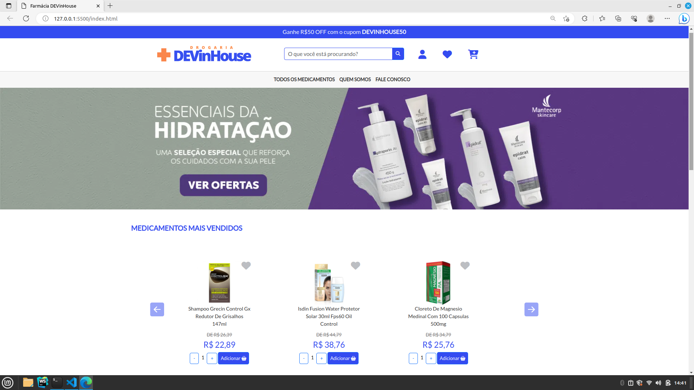
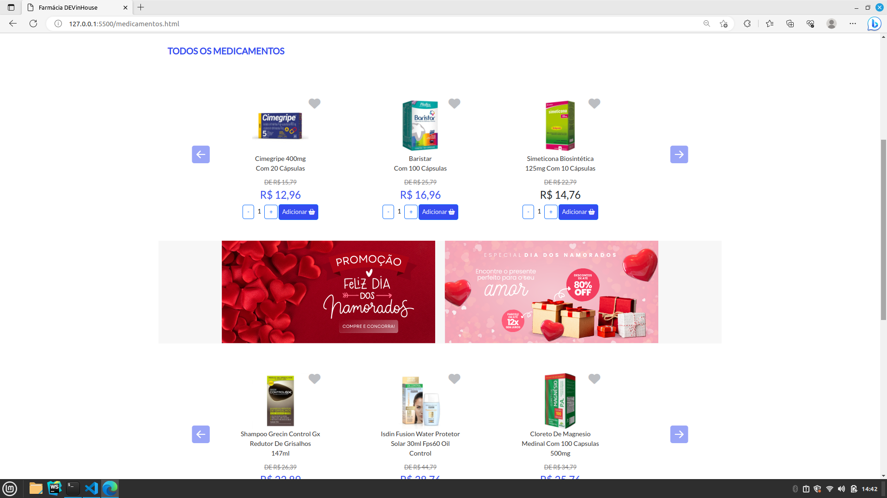
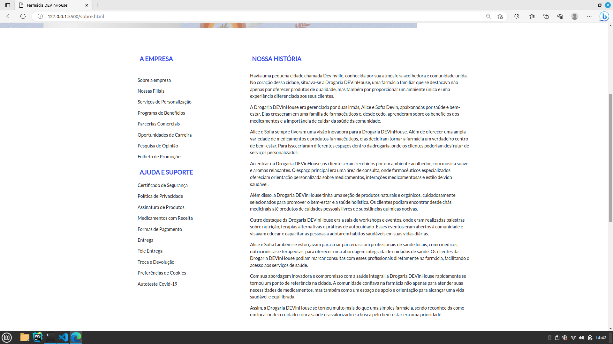
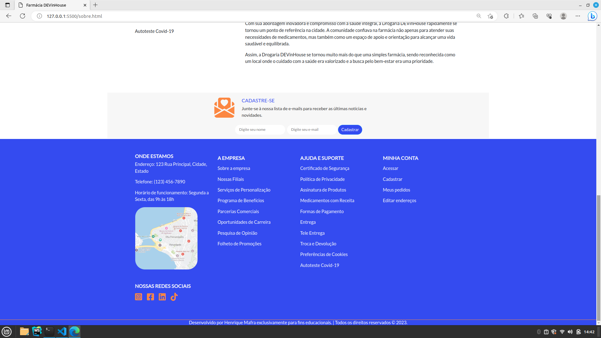
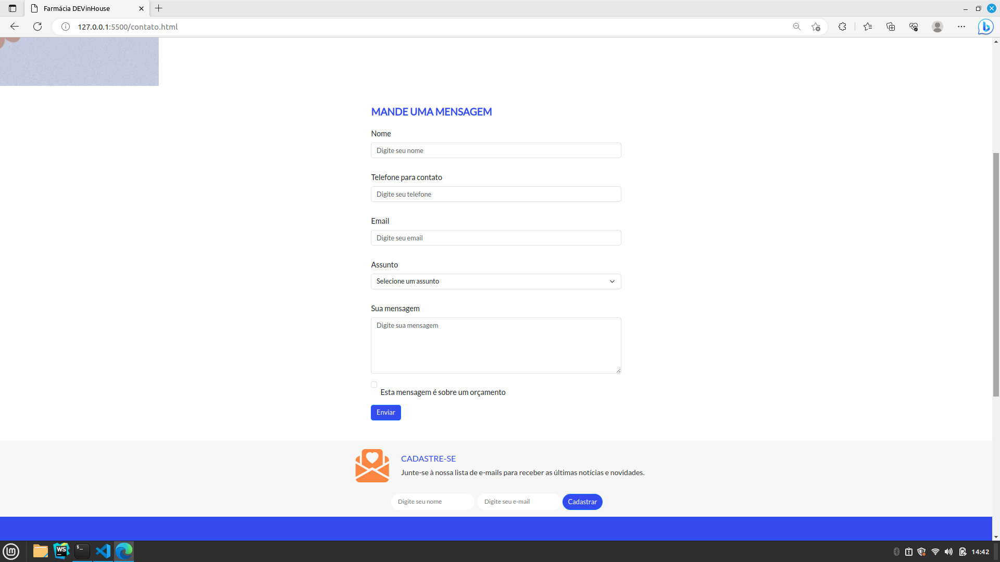

📝 **Farmácia DEVinHouse**

Projeto da Farmácia DEVinHouse, um site para uma farmácia fictícia com o intuito de reforçar o aprendizado. O projeto oferece uma pagina inicial, uma pagina do tipo quem Somos, uma página para medicamentos e outra para contato, contem informações detalhadas sobre os produtos por meio de cards, incluindo descrição, preço e opção de adicionar ao carrinho.

🌐 **Tecnologias Utilizadas**
- HTML
- CSS
- FontAwesome (biblioteca de ícones)

🔍 **Live Preview**
Confira o projeto em execução no seguinte link: [Live Preview](http://henriquemafra.com.br/devinhousefarma/index.html)

🔧 **Instalação e Uso**
1. Faça o download ou clone este repositório.
2. Abra o arquivo `index.html` em seu navegador.

🖼️ **Capturas de Tela**

📚 **Recursos**
- Barra de pesquisa para buscar medicamentos por nome.
- Menu de navegação para acesso rápido às seções do site.
- Lista de medicamentos mais vendidos.
- Detalhes de cada medicamento, incluindo imagem, nome, descrição e preço.
- Botão "Adicionar" para adicionar medicamentos ao carrinho.
- Seção de localização da loja.
- Links para redes sociais.

📝 **Contribuição**
Contribuições são bem-vindas! Sinta-se à vontade para abrir uma issue ou enviar um pull request com melhorias, correções de bugs ou novos recursos.

📄 **Licença**
Este projeto está sob a [THE UNLICENSE](LICENSE).

---

Desenvolvido como Mini-Projeto durante o curso Full-Stack DEVinHouse | © 2023 Henrique Mafra.

🌐 **Redes Sociais**
- [LinkedIn](https://www.linkedin.com/in/henriquemafradev/)

Obrigado por visitar meu projeto! 😊🏥💊
